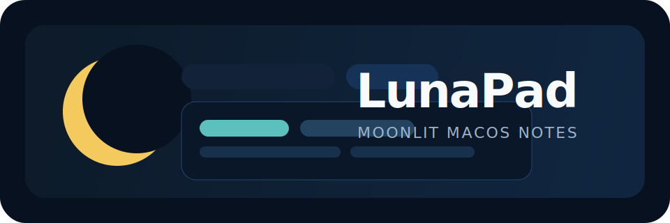

# LunaPad

<p align="center">
  
</p>

<p align="center">
  A focused macOS text editor with workspace-level super-tabs, per-workspace file tabs, fast keyboard workflows, and a clean native feel.
</p>

<p align="center">
  <a href="#features">Features</a> •
  <a href="#download">Download</a> •
  <a href="#why-lunapad">Why LunaPad</a> •
  <a href="#install">Install</a> •
  <a href="#build-from-source">Build</a> •
  <a href="#roadmap">Roadmap</a> •
  <a href="#contributing">Contributing</a>
</p>

## Why LunaPad

LunaPad is a lightweight native editor for people who keep multiple ideas in motion at once.

Instead of treating tabs as a flat list, LunaPad gives you a top-level workspace strip. Each workspace has:

- its own renameable name
- its own independent file tab set
- its own find/replace state
- its own editing flow

That makes it practical to keep one workspace for scratch notes, one for a writing draft, one for code snippets, and one for research, all inside a single app window without losing context.

## Features

- Native macOS app built with SwiftUI and AppKit
- Workspace super-tabs above document tabs
- Renameable workspaces
- Independent tab stacks per workspace
- Drag-and-drop reordering for both workspace tabs and file tabs
- Session restoration after relaunch or crash
- Open multiple plain-text files
- Save and Save As flows
- Per-document dirty state indicators
- Find and replace with next/previous navigation
- Case-sensitive and whole-word search toggles
- Word wrap toggle
- Font panel integration
- Live cursor line/column status bar
- Simple local build script that installs directly to `/Applications`

## How It Works

LunaPad uses a two-layer navigation model:

1. The top bar is the workspace bar.
Each workspace behaves like a named editing zone.

2. The second bar is the file tab bar for the active workspace.
Each workspace owns its own `TabManager` and `FindReplaceManager`, so switching workspaces preserves context instead of flattening everything into one tab row.

This makes the app feel closer to having multiple small editors open at once, but with less window clutter.

## Download

You can download packaged builds from the GitHub Releases page:

- [Latest release](https://github.com/gkeane/LunaPad/releases/latest)

Current release assets include:

- a zipped `LunaPad.app` bundle for macOS
- a `.sha256` checksum file

Note: current releases are unsigned local builds. On first launch, macOS may require an extra confirmation step unless future builds are signed and notarized.

## Install

### Prebuilt local install

If you have the repo locally:

```bash
./build.sh
open /Applications/LunaPad.app
```

The build script compiles the app, creates `LunaPad.app`, and refreshes the installed copy at `/Applications/LunaPad.app`.

## Build From Source

### Requirements

- macOS 13 or newer
- Xcode installed
- Xcode license accepted via `sudo xcodebuild -license`

### Build

```bash
./build.sh
```

### What the build script does

- selects the Xcode toolchain if available
- redirects Swift module caches to `/tmp`
- builds the release binary with SwiftPM
- bundles a native `.app`
- installs the app to `/Applications/LunaPad.app`

## Keyboard Shortcuts

- `Cmd-N` new file tab
- `Cmd-Shift-N` new workspace
- `Cmd-O` open file
- `Cmd-S` save
- `Cmd-Shift-S` save as
- `Cmd-W` close file tab
- `Cmd-Shift-W` close workspace
- `Cmd-F` find
- `Cmd-H` find and replace
- `Cmd-T` font panel

## Project Structure

```text
Sources/
  MainView.swift            Main UI, workspace strip, file tabs, editor layout
  WorkspaceManager.swift    Workspace-level state and switching
                           plus session persistence and restore
  FindReplaceManager.swift  Search and replace state
  NoteTextEditor.swift      AppKit-backed text editor bridge
build.sh                    Build, bundle, and install script
bundle-app.sh               App bundle assembly
```

## Positioning

LunaPad is not trying to replace a full IDE or a giant plugin-driven editor.

It is for users who want:

- a fast local note editor
- stronger structure than a single scratch pad
- native macOS behavior
- multiple parallel note contexts without window chaos

## Roadmap

- Recent files and recent workspaces
- Markdown preview mode
- Search result highlighting in the editor gutter
- Optional autosave and crash recovery
- Custom app icon and signed distribution build

## Contributing

Issues and pull requests are welcome.

If you want to contribute, strong first candidates are:

- usability polish on the workspace bar
- keyboard navigation improvements
- file reopen/session restore
- better document lifecycle prompts for unsaved changes
- automated tests around workspace and tab state

## License

MIT. See [LICENSE](LICENSE).
